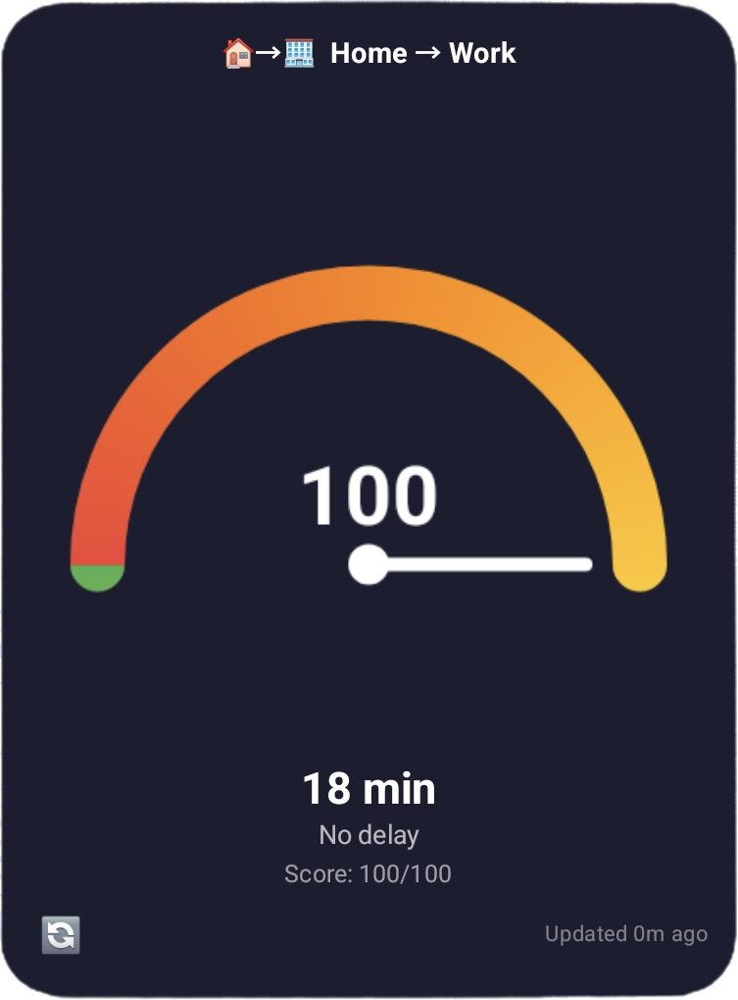

# 🚦 Traffic Home Widget

An Android widget that shows real-time traffic conditions for your commute home using a simple **green/yellow/red gauge**.



## Features

- 🟢 **Green** - Clear roads (< 15% delay)
- 🟡 **Yellow** - Moderate traffic (15-35% delay)  
- 🔴 **Red** - Heavy traffic (> 35% delay)
- ⏱️ Shows estimated travel time with current traffic
- 📍 Uses your current location automatically
- 🗺️ Tap gauge to open Waze/Google Maps navigation
- 🔄 Updates every 15 minutes in background

## Setup

### 1. Get a Google Maps API Key

1. Go to [Google Cloud Console](https://console.cloud.google.com)
2. Create a new project (or select existing)
3. Enable these APIs:
   - **Routes API** (for traffic data) - NOT the legacy Directions API!
   - **Geocoding API** (for address lookup)
4. Go to "Credentials" → "Create Credentials" → "API Key"
5. (Optional) Restrict the key to Android apps for security

### 2. Build with GitHub Actions (Recommended - No Android Studio!)

1. **Fork this repo** to your GitHub account

2. **Add your API key as a secret:**
   - Go to your repo → Settings → Secrets and variables → Actions
   - Click "New repository secret"
   - Name: `MAPS_API_KEY`
   - Value: Your Google Maps API key

3. **Trigger the build:**
   - Go to Actions tab → "Build Android APK"
   - Click "Run workflow" → "Run workflow"

4. **Download the APK:**
   - Wait for the build to complete (~3-5 minutes)
   - Click on the completed workflow run
   - Scroll down to "Artifacts"
   - Download `traffic-widget-debug` or `traffic-widget-release`
   - Install the APK on your phone!

### Alternative: Build Locally

```bash
# Clone the project
cd traffic-widget

# Add your API key
echo "MAPS_API_KEY=YOUR_KEY_HERE" >> gradle.properties

# Build (requires Android Studio or command line tools)
./gradlew assembleDebug

# Install
adb install app/build/outputs/apk/debug/app-debug.apk
```

### 3. Configure the Widget

1. Open the **Traffic Widget** app
2. Enter your Google Maps API key
3. Search for your home address
4. Add the widget to your home screen

## How It Works

The widget uses the **Google Maps Directions API** to get:
- `duration` - Normal travel time without traffic
- `duration_in_traffic` - Real-time travel time with current traffic

The **traffic ratio** is calculated as:
```
ratio = duration_in_traffic / duration
```

- **Green**: ratio < 1.15 (less than 15% slower)
- **Yellow**: ratio < 1.35 (15-35% slower)
- **Red**: ratio >= 1.35 (more than 35% slower)

## Permissions

- **Location** - To know your current position
- **Internet** - To fetch traffic data
- **Background Location** - For automatic updates (Android 10+)

## API Costs

Google Maps Directions API pricing (as of 2024):
- **Free tier**: $200/month credit
- **Cost**: ~$0.005 per request
- **Widget rate**: ~96 requests/day = ~$0.48/day ≈ $14/month

With the free tier, you can run this widget for free!

## Customization

### Adjust Thresholds

Edit `TrafficWidgetProvider.kt`:

```kotlin
const val THRESHOLD_GREEN = 1.15f   // Change to adjust green threshold
const val THRESHOLD_YELLOW = 1.35f  // Change to adjust yellow threshold
```

### Update Frequency

Edit `TrafficWidgetProvider.kt`:

```kotlin
PeriodicWorkRequestBuilder<TrafficCheckWorker>(
    15, TimeUnit.MINUTES  // Minimum is 15 minutes (Android limitation)
)
```

## Why Not Use Waze API Directly?

Waze doesn't offer a public API for traffic data. Their Transport SDK is only for partners. However, since Waze is owned by Google, the Google Maps Directions API provides similar real-time traffic data.

## Future Ideas

- [ ] Multiple destinations (work, gym, etc.)
- [ ] Time-based routing (different routes for different times)
- [ ] Notification when traffic clears
- [ ] Historical traffic patterns
- [ ] Widget size variants (1x1, 2x1, 2x2)

## License

MIT License - do whatever you want with it! 🎉
